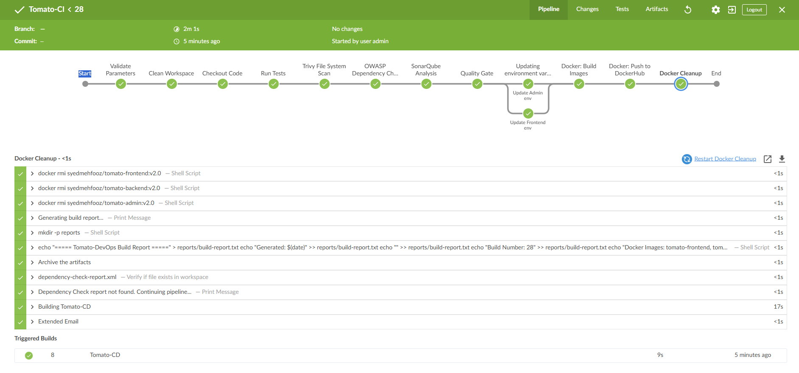
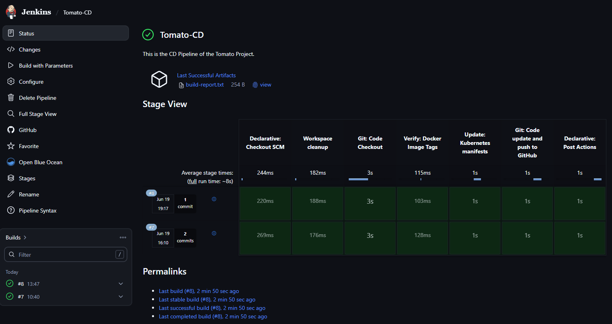
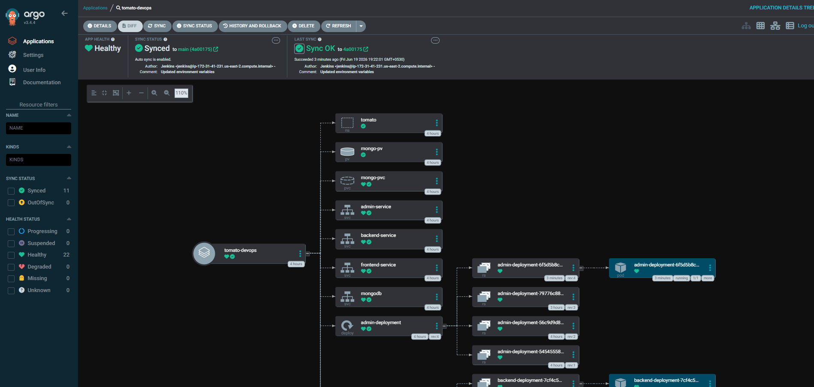
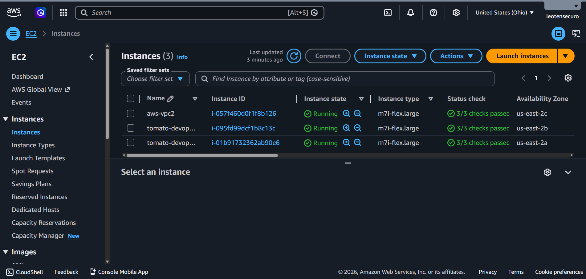
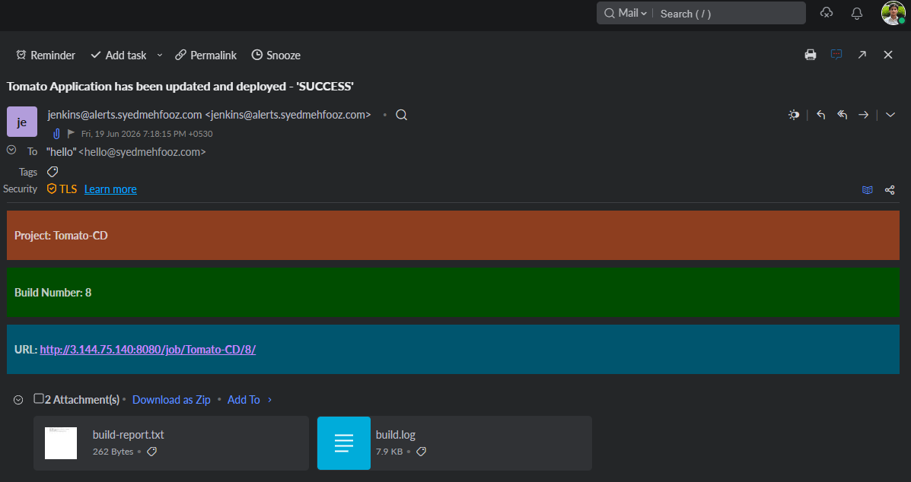
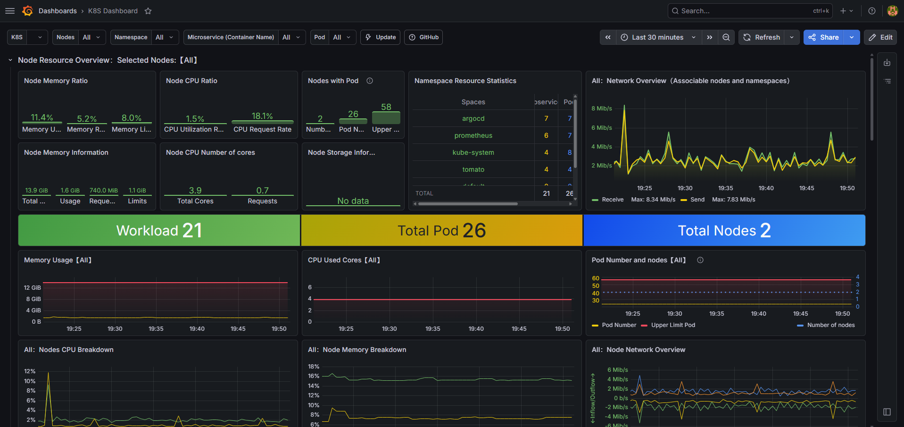

<div align="center">


<br />

# 🍅 Tomato — Food Delivery Platform

### *End-to-End DevSecOps · CI/CD · Cloud-Native Deployment on AWS EKS*

<br/>

[](https://github.com/syedmehfooz47/tomato-devops)
[](LICENSE)
[](https://www.jenkins.io/)
[](https://argoproj.github.io/cd/)
[](https://aws.amazon.com/eks/)
[](https://www.sonarqube.org/)

<br/>

**Tomato** is a production-grade Food Delivery web application built as a fully open-source project to demonstrate real-world DevSecOps, CI/CD automation, monitoring, observability, and cloud-native deployment skills.

<br/>

🌐 **[Live Demo — User Panel](https://food-delivery-frontend-s2l9.onrender.com/)** &nbsp;|&nbsp; 🔧 **[Live Demo — Admin Panel](https://food-delivery-admin-wrme.onrender.com/)**

</div>

---

## 📋 Table of Contents

> [!Important]
> Use this table to quickly navigate to any installation or configuration section.

| Component | Jump To |
|---|---|
| 🔧 Jenkins Master | [Install & Configure Jenkins](#jenkins) |
| ☁️ EKS Cluster | [Install eksctl & Create Cluster](#eks) |
| 🚀 ArgoCD | [Install & Configure ArgoCD](#argo) |
| 🤖 Jenkins Worker Node | [Setup Jenkins Worker](#jenkins-worker) |
| 🛡️ OWASP | [Install & Configure OWASP](#owasp) |
| 🔍 SonarQube | [Install & Configure SonarQube](#sonar) |
| 📧 Email Notifications | [Email Notification Setup](#mail) |
| 📊 Monitoring | [Prometheus & Grafana via Helm](#monitor) |
| 🗑️ Clean Up | [Delete Resources](#clean) |

---

## 🎯 Project Overview

Tomato is aimed at contributing to open source while building expertise in:

- **DevSecOps** — integrating security at every stage of the pipeline
- **CI/CD** — automated build, test, and deploy workflows
- **Containerization** — Docker-based application packaging
- **Cloud-Native** — Kubernetes orchestration on AWS EKS
- **Monitoring & Observability** — Prometheus + Grafana dashboards
- **Alerting** — Email notifications from Jenkins pipeline

---

## 🚀 Project Deployment Flow

<div align="center">


*Full end-to-end DevSecOps & GitOps deployment pipeline*

</div>

---

## 🛠️ Tech Stack

| Technology | Purpose |
|---|---|
|  | Source Code & Version Control |
|  | Containerization |
|  | Continuous Integration (CI) |
|  | Dependency Security Check |
|  | Code Quality Analysis |
|  | Filesystem & Image Scanning |
|  | Continuous Delivery (CD) / GitOps |
|  | Managed Kubernetes Cluster |
|  | Monitoring via Grafana & Prometheus |

---

## 📸 Pipeline Screenshots

<div align="center">

### ⚙️ CI Pipeline — Build & Push



<br/>

### 🔄 CD Pipeline — Update Application Version



<br/>

### 🚀 ArgoCD — Application Deployment on EKS



</div>

---

## 🏗️ Infrastructure Prerequisites

> [!Note]
> This project is implemented on the **Ohio** region (`us-east-2`). Adjust region flags accordingly.

### Master Machine Setup (AWS EC2)

- **Instance Type:** `m7i.flex.large` — 2 vCPU, 8 GB RAM
- **Storage:** 29 GB
- **Purpose:** Jenkins Master, eksctl, EKS cluster management

> [!Note]
> Open the required ports in the Security Group of the master machine and attach the **same security group** to the Jenkins worker node.

#### Install & Configure Docker

```bash
sudo apt-get update -y
```

```bash
sudo apt-get install docker.io -y
sudo usermod -aG docker ubuntu && newgrp docker
```

> [!Note]
> `newgrp docker` refreshes the group config — **no EC2 restart required**.

---

## 🔧 Jenkins Setup

<h3 id="jenkins">Install and Configure Jenkins (Master Machine)</h3>

#### Step 1 — Install Java

```bash
sudo apt update -y
sudo apt install fontconfig openjdk-21-jre -y
java -version
```

#### Step 2 — Install Jenkins

```bash
sudo wget -O /etc/apt/keyrings/jenkins-keyring.asc \
  https://pkg.jenkins.io/debian-stable/jenkins.io-2026.key

echo "deb [signed-by=/etc/apt/keyrings/jenkins-keyring.asc]" \
  https://pkg.jenkins.io/debian-stable binary/ | sudo tee \
  /etc/apt/sources.list.d/jenkins.list > /dev/null

sudo apt update
sudo apt install jenkins -y
```

> [!Note]
> Access Jenkins Master on the browser at **port `8080`** and complete the initial setup.

---

## ☁️ EKS Cluster Setup

<h3 id="eks">Create EKS Cluster on AWS (Master Machine)</h3>

**Prerequisites:**

- IAM user with **Access Keys & Secret Access Keys**
- AWS CLI configured

#### Install AWS CLI v2

```bash
curl "https://awscli.amazonaws.com/awscli-exe-linux-x86_64.zip" -o "awscliv2.zip"
sudo apt-get install unzip -y
unzip awscliv2.zip
sudo ./aws/install

# Confgure AWS CLI with Access Key ID and Secret Access Key.
aws configure
```

#### Install kubectl

```bash
curl -LO "https://dl.k8s.io/release/$(curl -L -s https://dl.k8s.io/release/stable.txt)/bin/linux/amd64/kubectl"
curl -LO "https://dl.k8s.io/release/$(curl -L -s https://dl.k8s.io/release/stable.txt)/bin/linux/amd64/kubectl.sha256"
echo "$(cat kubectl.sha256)  kubectl" | sha256sum --check
sudo install -o root -g root -m 0755 kubectl /usr/local/bin/kubectl
kubectl version --client
```

#### Install eksctl (For Linux)

```bash
# For ARM systems, set ARCH to: arm64, armv6 or armv7
ARCH=amd64
PLATFORM=$(uname -s)_$ARCH

curl -sLO "https://github.com/eksctl-io/eksctl/releases/latest/download/eksctl_${PLATFORM}.tar.gz"
curl -sL "https://github.com/eksctl-io/eksctl/releases/latest/download/eksctl_checksums.txt" | grep $PLATFORM | sha256sum --check
tar -xzf eksctl_${PLATFORM}.tar.gz -C /tmp && rm eksctl_${PLATFORM}.tar.gz
sudo install -m 0755 /tmp/eksctl /usr/local/bin && rm /tmp/eksctl
eksctl version
```

#### Create EKS Cluster

```bash
eksctl create cluster --name=tomato-devops \
                      --region=us-east-2 \
                      --version=1.36 \
                      --without-nodegroup
```

#### Associate IAM OIDC Provider

```bash
eksctl utils associate-iam-oidc-provider \
  --region us-east-2 \
  --cluster tomato-devops \
  --approve
```

#### Create Node Group

```bash
eksctl create nodegroup --cluster=tomato-devops \
                        --region=us-east-2 \
                        --name=tomato \
                        --node-type=m7i-flex.large \
                        --nodes=2 \
                        --nodes-min=2 \
                        --nodes-max=2 \
                        --node-volume-size=29 \
                        --ssh-access \
                        --ssh-public-key=aws-key
```

> [!Note]
> Make sure the SSH public key `aws-key` is available in your AWS account.

---

## 🤖 Jenkins Worker Node Setup

<h3 id="jenkins-worker">Setting Up Jenkins Worker Node</h3>

- Create a new EC2 instance with **2 vCPU, 8 GB RAM** (`m7i-flex.large`) and **29 GB storage**

#### Install Java on Worker Node

```bash
sudo apt update -y
sudo apt install fontconfig openjdk-21-jre -y
java -version
```

- Create an IAM role with **Administrator Access** and attach it to the Jenkins worker node:
  > **EC2 Instance → Actions → Security → Modify IAM Role**

#### Install AWS CLI on Worker Node

```bash
sudo su
```

```bash
curl "https://awscli.amazonaws.com/awscli-exe-linux-x86_64.zip" -o "awscliv2.zip"
sudo apt install unzip -y
unzip awscliv2.zip
sudo ./aws/install
aws configure
```

#### Generate SSH Keys (Master Machine) for Jenkins Master-Slave

```bash
ssh-keygen
```

> [!Note]
> Move to the directory where SSH keys are generated, copy the **public key** content, and paste it into the `authorized_keys` file on the Jenkins worker node.

#### Configure Jenkins Node

Navigate to **Manage Jenkins → Nodes → Add Node** and configure:

| Field | Value |
|---|---|
| Name | `Node` |
| Type | Permanent Agent |
| Number of Executors | `2` |
| Labels | `Node` |
| Usage | Only build jobs with label expressions matching this node |
| Launch Method | Via SSH |
| Host | `<public-ip-worker-jenkins>` |
| Credentials | SSH username with private key → ID: `Worker` → Username: `root` → Add private key |
| Host Key Verification Strategy | Non Verifying Verification Strategy |
| Availability | Keep this agent online as much as possible |

---

## 🐳 Install Docker (Jenkins Worker)

```bash
sudo apt install docker.io -y
sudo usermod -aG docker ubuntu && newgrp docker
```

---

## 🔍 SonarQube Setup

<h3 id="sonar">Install and Configure SonarQube (Master Machine)</h3>

```bash
docker run -itd --name sonarqube-server -p 9000:9000 sonarqube:community
```

---

## 🛡️ Trivy Setup

<h3 id="trivy">Install Trivy (Jenkins Worker)</h3>

```bash
sudo apt-get install wget gnupg -y
wget -qO - https://aquasecurity.github.io/trivy-repo/deb/public.key | gpg --dearmor | sudo tee /usr/share/keyrings/trivy.gpg > /dev/null
echo "deb [signed-by=/usr/share/keyrings/trivy.gpg] https://aquasecurity.github.io/trivy-repo/deb generic main" | sudo tee -a /etc/apt/sources.list.d/trivy.list
sudo apt-get update
sudo apt-get install trivy -y
```

---

## 🚀 ArgoCD Setup

<h3 id="argo">Install and Configure ArgoCD (Master Machine)</h3>

#### Create ArgoCD Namespace

```bash
kubectl create namespace argocd
```

#### Apply ArgoCD Manifest

```bash
kubectl apply -n argocd -f https://raw.githubusercontent.com/argoproj/argo-cd/stable/manifests/install.yaml
```

#### Verify All Pods Are Running

```bash
watch kubectl get pods -n argocd
```

#### Install ArgoCD CLI

```bash
sudo curl --silent --location -o /usr/local/bin/argocd \
  https://github.com/argoproj/argo-cd/releases/download/v2.4.7/argocd-linux-amd64
```

#### Grant Executable Permission

```bash
sudo chmod +x /usr/local/bin/argocd
```

#### Check ArgoCD Services

```bash
kubectl get svc -n argocd
```

#### Expose ArgoCD Server (ClusterIP → NodePort)

```bash
kubectl patch svc argocd-server -n argocd -p '{"spec": {"type": "NodePort"}}'
```

#### Confirm Service Patch

```bash
kubectl get svc -n argocd
```

- Check the port where ArgoCD server is running and **expose it in the Security Group** of the worker node.
- Access it on browser, click **Advanced** and proceed.

```bash
<public-ip-worker>:<port>
```

#### Fetch Initial ArgoCD Admin Password

```bash
kubectl -n argocd get secret argocd-initial-admin-secret -o jsonpath="{.data.password}" | base64 -d; echo
```

> **Username:** `admin`  
> Navigate to **User Info** and update your ArgoCD password after first login.

---

## 📧 Email Notification Setup

<h3 id="mail">Configure Email Notifications</h3>

- Go to your **Jenkins Master EC2 instance** and allow **port `465`** (SMTPS) in the security group.

#### Generate Gmail App Password

- Open Gmail → **Manage your Google Account → Security**

> **2-Step Verification must be enabled** before you can create an App Password.

- Search for **App passwords** and create one specifically for Jenkins.

#### Configure Jenkins Credentials for Email

Navigate to **Manage Jenkins → Credentials** and add:

- **Kind:** Username and Password
- **Username:** your Gmail address
- **Password:** the App Password you just created

#### Configure Extended Email in Jenkins

Navigate to **Manage Jenkins → System** and search for:

1. **Extended E-mail Notification** — fill in SMTP settings
2. **E-mail Notification** — complete setup and test

> In **E-mail Notification → Advanced**, enter the Gmail App Password in the password field.

---

### Alternative: Resend (Custom Domain Email)

You can also use SMTP-based email providers like **[Resend](https://resend.com)** if you have your own domain.

1. Sign up at [resend.com](https://resend.com) (free tier available)
2. Connect your domain (e.g., `alerts.yourdomain.com`) by adding MX, SPF, DMARC, and DKIM records at your DNS provider
3. Generate an API key from the Resend dashboard

**Resend SMTP Settings:**

| Field | Value |
|---|---|
| SMTP Host | `smtp.resend.com` |
| SMTP Port | `465` |
| Username | `resend` |
| Password | Your Resend API Key |

Go to **Manage Jenkins → Credentials** and add the Resend credentials using the values above.

---

## ⚙️ Full Project Implementation Steps

### Step 1 — Install Jenkins Plugins

Navigate to **Manage Jenkins → Plugins → Available Plugins** and install:

- `OWASP Dependency-Check`
- `SonarQube Scanner`
- `Docker`
- `Pipeline: Stage View`

---

### Step 2 — Configure OWASP

<h4 id="owasp">Configure OWASP Dependency Check</h4>

Navigate to **Manage Jenkins → Plugins → Available Plugins** and install OWASP, then go to **Manage Jenkins → Tools** to configure it.

---

### Step 3 — Integrate SonarQube with Jenkins

#### Create SonarQube Token

- In SonarQube: **Administration → Security → Users → Token**

#### Add SonarQube Credentials to Jenkins

- Navigate to **Manage Jenkins → Credentials** and add the SonarQube token.

#### Configure SonarQube Scanner Tool

- Navigate to **Manage Jenkins → Tools** → search for **SonarQube Scanner Installations**.

#### Add SonarQube Server to Jenkins

- Navigate to **Manage Jenkins → System** → search for **SonarQube Installations**.

---

### Step 4 — Add GitHub Credentials

Navigate to **Manage Jenkins → Credentials** and add GitHub credentials for pushing updated code from the pipeline.

> [!Important]
> Use a **Personal Access Token (PAT)** in the password field when adding GitHub credentials.

---

### Step 5 — Configure Pipeline Libraries

Navigate to **Manage Jenkins → System** → search for **Global Trusted Pipeline Libraries**.

---

### Step 6 — Configure SonarQube Webhook

In SonarQube: **Administration → Webhooks → Create**

---

### Step 7 — Update Automation Scripts

In your GitHub repository, under the `Automations` directory, update the `instance-id` field in both:

- `update-frontend-env.sh`
- `update-admin-env.sh`

Replace with your **Kubernetes worker node's EC2 Instance ID**.

> [!Tip]
Even if you have multiple worker nodes, any node's instance ID would work, because all nodes are connected to each other in Kubernetes cluster, no matter which node's ID you provide.

---

### Step 8 — Add Docker Credentials to Jenkins

Navigate to **Manage Jenkins → Credentials** and add Docker Hub credentials to enable image push from the pipeline.

---

### Step 9 — Create CI/CD Pipelines

- Create a **`Tomato-CI`** pipeline in Jenkins
- Create a **`Tomato-CD`** pipeline in Jenkins

---

### Step 10 — Fix Docker Socket Permissions (Jenkins Worker)

```bash
chmod 777 /var/run/docker.sock
```


**Alternative approach:**

```bash
sudo usermod -aG docker jenkins && newgrp docker
```

---

### Step 11 — Add EKS Cluster to ArgoCD

#### Login to ArgoCD from CLI

```bash
argocd login 12.32.65.125:32738 --username admin
```

> [!Tip]
> Get the IP and port from your ArgoCD URL in the browser.


#### List Available Clusters

```bash
argocd cluster list
```

#### Get EKS Cluster Name

```bash
kubectl config get-contexts
```

#### Add EKS Cluster to ArgoCD

```bash
argocd cluster add tomato@tomato-devops.us-east-2.eksctl.io --name tomato-devops
```

> [!Tip]
> `tomato@tomato-devops.us-east-2.eksctl.io` → This should be **your** EKS cluster context name.

#### Verify Cluster in ArgoCD Console

Navigate to **Settings → Clusters** and confirm the cluster appears.

---

### Step 12 — Connect GitHub Repository to ArgoCD

Navigate to **Settings → Repositories → Connect Repo**.

> [!Note]
> The connection status should show **Successful**.

---

### Step 13 — Deploy Application via ArgoCD

Navigate to **Applications → New App** and fill in your application details.

> [!Important]
> Enable **Auto-Create Namespace** when creating the ArgoCD application.

---

### 🎉 Deployment Complete

Your application is now live on **AWS EKS Cluster**.

Open the ports needed (e.g., `31000` and `31100`) on the worker node and access in browser:

> [!Tip]
> You can use `kubectl get svc -n <namespace>` to find the node port.

```bash
<worker-public-ip>:31000
```

<div align="center">


*AWS EC2 Instances — Master & Worker Nodes*

</div>

---

### 📧 Email Notification Preview

<div align="center">


*Jenkins Pipeline Email Notification*

</div>

---

## 📊 Monitoring with Prometheus & Grafana

<h3 id="monitor">EKS Cluster Monitoring via Helm (Master Machine)</h3>

### Install Helm

```bash
curl -fsSL -o get_helm.sh https://raw.githubusercontent.com/helm/helm/main/scripts/get-helm-3
```

```bash
chmod 700 get_helm.sh
```

```bash
./get_helm.sh
```

### Add Helm Stable Charts

```bash
helm repo add stable https://charts.helm.sh/stable
```

### Add Prometheus Helm Repository

```bash
helm repo add prometheus-community https://prometheus-community.github.io/helm-charts
```

### Create Prometheus Namespace

```bash
kubectl create namespace prometheus
```

```bash
kubectl get ns
```

### Install Prometheus Stack via Helm

```bash
helm install stable prometheus-community/kube-prometheus-stack -n prometheus
```

### Verify Prometheus Installation

```bash
kubectl get pods -n prometheus
```

### Check Prometheus Services

```bash
kubectl get svc -n prometheus
```

### Expose Prometheus & Grafana (ClusterIP → NodePort)

> [!Important]
> After changing service type to `NodePort`, save the file and open the assigned node port in your security group.

```bash
kubectl edit svc stable-kube-prometheus-sta-prometheus -n prometheus
```

### Verify Service

```bash
kubectl get svc -n prometheus
```

### Expose Grafana Service

```bash
kubectl edit svc stable-grafana -n prometheus
```

### Check Grafana Service

```bash
kubectl get svc -n prometheus
```

### Get Grafana Admin Password

```bash
kubectl get secret --namespace prometheus stable-grafana \
  -o jsonpath="{.data.admin-password}" | base64 --decode; echo
```

> [!Note]
> **Username:** `admin`

### Grafana Dashboard

<div align="center">


*Kubernetes Cluster Monitoring — Grafana Dashboard*

</div>

---

## 🗑️ Clean Up

<h3 id="clean">Delete EKS Cluster & Resources</h3>

```bash
eksctl delete cluster --name=tomato-devops --region=us-east-2
```

---

<div align="center">

## 📸 App Preview


*Tomato — Food Delivery Menu Page*

</div>

---

<div align="center">

### 🙏 Acknowledgements

This project is an open-source contribution aimed at the DevSecOps and cloud-native community.  
Forked and extended with full DevSecOps pipeline implementation.

<br/>

Forked from [Tomato Food Delivery](https://github.com/Mshandev/Food-Delivery)

Built with ❤️ by [Syed Mehfooz C S](https://github.com/syedmehfooz47)

[](https://github.com/syedmehfooz47)

</div>
